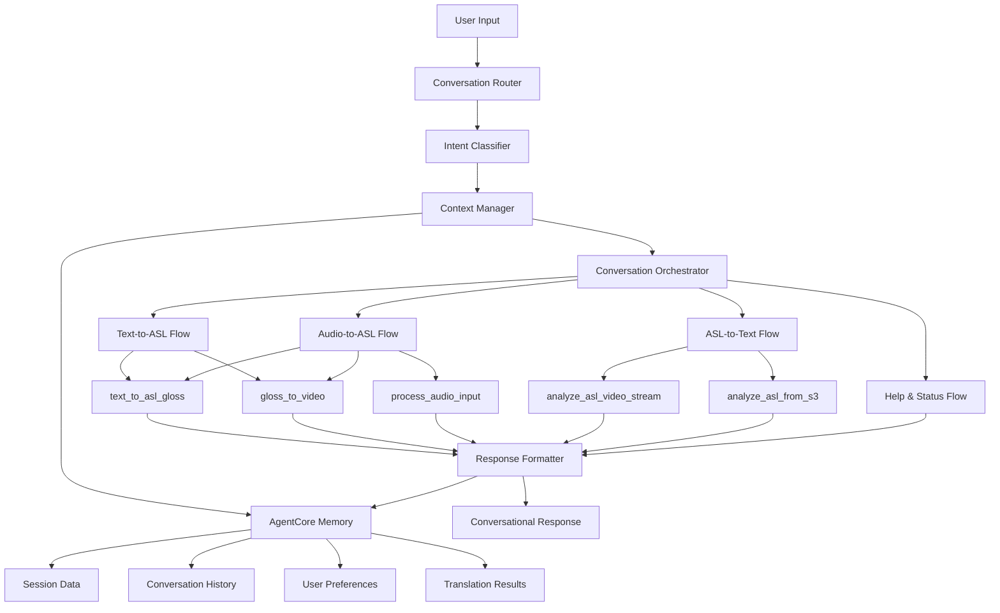

# Design Document

## Overview

The Conversational Bidirectional ASL Agent is designed as an enhanced version of the existing SignLanguageAgent that provides natural, context-aware conversations for ASL translation services. The agent will leverage the existing translation tools while adding sophisticated conversation management, intent classification, and response formatting capabilities.

## Architecture

### High-Level Architecture



### Core Components

1. **Conversation Router**: Entry point that handles all user interactions
2. **Intent Classifier**: Determines user intent from natural language input
3. **Context Manager**: Maintains conversation state and history using AgentCore Memory
4. **Conversation Orchestrator**: Coordinates translation workflows based on intent
5. **Response Formatter**: Formats results into natural conversational responses
6. **AgentCore Memory Integration**: Persistent storage for sessions, history, and preferences
7. **Existing Tools**: Leverages current text2gloss, gloss2video, audio processing, and ASL analysis tools

### AgentCore Memory Usage Patterns

**Session Management**:
```python
# Store conversation context
memory.store(f"session:{session_id}:context", conversation_context)

# Retrieve conversation context
context = memory.retrieve(f"session:{session_id}:context")

# Store conversation history with automatic serialization
memory.store(f"session:{session_id}:history", interaction_history)

# Store user preferences
memory.store(f"session:{session_id}:preferences", user_preferences)
```

**Memory Lifecycle**:
- **Session Creation**: Initialize memory keys when new conversation starts
- **Context Updates**: Update memory after each interaction
- **Automatic Cleanup**: Leverage AgentCore's TTL and cleanup policies
- **Cross-Session Data**: Store user preferences that persist across sessions

## Components and Interfaces

### Conversation Router

**Purpose**: Main entry point that routes conversations and manages the overall interaction flow.

**Interface**:
```python
class ConversationRouter:
    def handle_conversation(self, user_input: str, session_id: str, 
                          metadata: Dict[str, Any]) -> ConversationResponse
    def initialize_session(self, session_id: str) -> ConversationSession
    def cleanup_session(self, session_id: str) -> None
```

**Responsibilities**:
- Route incoming user messages to appropriate handlers
- Initialize and manage conversation sessions
- Coordinate between intent classification and response generation
- Handle session lifecycle management

### Intent Classifier

**Purpose**: Analyzes user input to determine intent and extract relevant parameters.

**Interface**:
```python
class ConversationIntentClassifier:
    def classify_intent(self, user_input: str, context: ConversationContext) -> IntentResult
    def extract_parameters(self, user_input: str, intent: ConversationIntent) -> Dict[str, Any]
    def detect_input_type(self, metadata: Dict[str, Any]) -> InputType
```

**Intent Types**:
- `TEXT_TO_ASL`: User wants to translate text to ASL
- `AUDIO_TO_ASL`: User wants to translate audio to ASL
- `ASL_TO_TEXT`: User wants to translate ASL to text
- `HELP_REQUEST`: User needs help or information
- `STATUS_CHECK`: User wants to check operation status
- `RETRY_REQUEST`: User wants to retry or modify previous translation
- `CONTEXT_REFERENCE`: User is referring to previous conversation elements

### Context Manager

**Purpose**: Maintains conversation state, history, and user preferences across interactions using AgentCore Memory.

**Interface**:
```python
class ConversationContextManager:
    def __init__(self, memory: AgentCoreMemory):
        self.memory = memory
    
    def get_context(self, session_id: str) -> ConversationContext
    def update_context(self, session_id: str, interaction: ConversationInteraction) -> None
    def store_translation_result(self, session_id: str, result: TranslationResult) -> None
    def get_conversation_history(self, session_id: str, limit: int = 10) -> List[ConversationInteraction]
    def store_user_preferences(self, session_id: str, preferences: Dict[str, Any]) -> None
    def get_user_preferences(self, session_id: str) -> Dict[str, Any]
```

**AgentCore Memory Integration**:
- **Session Storage**: Use AgentCore memory to persist conversation sessions across invocations
- **Conversation History**: Store interaction history with automatic cleanup policies
- **Translation Results**: Cache previous translation results for context references
- **User Preferences**: Maintain user-specific settings and patterns
- **Memory Keys**: Use structured keys like `session:{session_id}:context`, `session:{session_id}:history`, `session:{session_id}:preferences`

### Conversation Orchestrator

**Purpose**: Coordinates translation workflows and manages the execution of translation operations.

**Interface**:
```python
class ConversationOrchestrator:
    def execute_translation_flow(self, intent: IntentResult, context: ConversationContext) -> TranslationResult
    def handle_text_to_asl_flow(self, text: str, context: ConversationContext) -> TranslationResult
    def handle_audio_to_asl_flow(self, audio_params: Dict, context: ConversationContext) -> TranslationResult
    def handle_asl_to_text_flow(self, video_params: Dict, context: ConversationContext) -> TranslationResult
```

**Workflow Management**:
- Coordinates calls to existing translation tools
- Manages error handling and fallback strategies
- Provides progress updates for long-running operations
- Handles retry logic and alternative approaches

### Response Formatter

**Purpose**: Formats translation results and system responses into natural conversational language.

**Interface**:
```python
class ConversationResponseFormatter:
    def format_translation_response(self, result: TranslationResult, context: ConversationContext) -> str
    def format_error_response(self, error: Exception, context: ConversationContext) -> str
    def format_help_response(self, help_type: HelpType, context: ConversationContext) -> str
    def format_status_response(self, status: OperationStatus, context: ConversationContext) -> str
```

**Response Types**:
- Translation completion responses with results and next steps
- Error responses with helpful guidance and alternatives
- Help responses with examples and explanations
- Status updates with progress information
- Context-aware suggestions and tips

## Data Models

### ConversationContext

```python
@dataclass
class ConversationContext:
    session_id: str
    user_id: Optional[str]
    conversation_history: List[ConversationInteraction]
    last_translation: Optional[TranslationResult]
    user_preferences: Dict[str, Any]
    current_operations: List[str]
    session_start_time: datetime
    last_activity_time: datetime
```

### ConversationInteraction

```python
@dataclass
class ConversationInteraction:
    timestamp: datetime
    user_input: str
    intent: ConversationIntent
    agent_response: str
    translation_result: Optional[TranslationResult]
    metadata: Dict[str, Any]
```

### TranslationResult

```python
@dataclass
class TranslationResult:
    input_text: Optional[str]
    input_type: InputType
    gloss: Optional[str]
    video_urls: Dict[str, str]  # pose, sign, avatar URLs
    interpreted_text: Optional[str]  # for ASL-to-text
    processing_time: float
    success: bool
    error_message: Optional[str]
```

### IntentResult

```python
@dataclass
class IntentResult:
    intent: ConversationIntent
    confidence: float
    parameters: Dict[str, Any]
    input_type: InputType
    requires_context: bool
```

## Error Handling

### Error Classification

1. **User Input Errors**: Invalid or missing parameters, unsupported formats
2. **Translation Errors**: Tool failures, model errors, processing timeouts
3. **System Errors**: Infrastructure issues, service unavailability
4. **Context Errors**: Session timeouts, invalid references to previous interactions

### Error Recovery Strategies

1. **Graceful Degradation**: Provide alternative translation methods when primary tools fail
2. **User Guidance**: Offer specific instructions for correcting input errors
3. **Retry Logic**: Automatically retry failed operations with exponential backoff
4. **Fallback Responses**: Provide helpful responses even when translations fail completely

### Conversational Error Handling

```python
class ConversationErrorHandler:
    def handle_translation_error(self, error: Exception, context: ConversationContext) -> str
    def suggest_alternatives(self, failed_operation: str, context: ConversationContext) -> List[str]
    def format_user_guidance(self, error_type: ErrorType, context: ConversationContext) -> str
```

## Testing Strategy

### Unit Testing

1. **Intent Classification Tests**: Verify correct intent detection for various user inputs
2. **Context Management Tests**: Ensure proper context storage and retrieval
3. **Response Formatting Tests**: Validate conversational response generation
4. **Error Handling Tests**: Test graceful error handling and recovery

### Integration Testing

1. **End-to-End Conversation Tests**: Test complete conversation flows
2. **Tool Integration Tests**: Verify proper integration with existing translation tools
3. **Session Management Tests**: Test session lifecycle and cleanup
4. **Multi-Modal Input Tests**: Test switching between text, audio, and video inputs

### Conversation Flow Testing

1. **Natural Language Understanding**: Test intent classification with varied user expressions
2. **Context Continuity**: Verify context preservation across multiple interactions
3. **Error Recovery**: Test conversational error handling and user guidance
4. **Help System**: Validate help responses and capability explanations

### Performance Testing

1. **Response Time**: Ensure conversational responses are generated quickly
2. **Context Scalability**: Test context management with long conversation histories
3. **Concurrent Sessions**: Verify proper handling of multiple simultaneous conversations
4. **Memory Usage**: Monitor memory consumption for context storage

## Integration with Existing System

### AgentCore Memory Integration

The conversational agent will leverage AgentCore's built-in memory system for persistent state management:

1. **Memory Storage**: Use AgentCore memory for session persistence across invocations
2. **Automatic Cleanup**: Leverage AgentCore's memory management for session lifecycle
3. **Structured Keys**: Implement consistent memory key patterns for different data types
4. **Memory Efficiency**: Use AgentCore's optimized memory storage for conversation data

**Memory Key Structure**:
```
session:{session_id}:context          # Current conversation context
session:{session_id}:history          # Conversation interaction history
session:{session_id}:preferences      # User preferences and settings
session:{session_id}:last_result      # Most recent translation result
user:{user_id}:global_preferences     # Cross-session user preferences
```

### Leveraging Existing Tools

The conversational agent will use all existing translation tools without modification:

1. **text_to_asl_gloss**: For English text to ASL gloss conversion
2. **gloss_to_video**: For generating ASL videos from gloss
3. **process_audio_input**: For audio transcription
4. **analyze_asl_video_stream**: For ASL video analysis from streams
5. **analyze_asl_from_s3**: For ASL video analysis from S3

### Enhanced Workflow Orchestration

The new agent will provide enhanced orchestration of these tools:

1. **Intelligent Routing**: Automatically determine which tools to use based on user intent
2. **Progress Tracking**: Provide real-time updates during multi-step operations
3. **Result Aggregation**: Combine results from multiple tools into coherent responses
4. **Error Coordination**: Handle errors across the entire workflow chain
5. **Memory-Backed Context**: Use AgentCore memory to maintain context across tool invocations

### Backward Compatibility

The conversational agent will maintain compatibility with existing interfaces:

1. **API Compatibility**: Support existing payload formats for direct tool access
2. **Response Formats**: Provide both conversational and structured response options
3. **Configuration**: Use existing environment variables and configuration patterns
4. **Deployment**: Deploy as enhanced version of existing SignLanguageAgent
5. **Memory Migration**: Seamlessly handle sessions with and without memory context

## Deployment Considerations

### Container Configuration

The conversational agent will be deployed as an enhanced version of the existing SignLanguageAgent:

1. **Same Base Image**: Use existing Docker configuration with additional dependencies
2. **Environment Variables**: Add new configuration options while preserving existing ones
3. **Resource Requirements**: Similar resource needs with additional memory for context storage
4. **Health Checks**: Enhanced health checks that include conversation system status

### Monitoring and Observability

1. **Conversation Metrics**: Track conversation success rates, intent classification accuracy
2. **Context Usage**: Monitor context storage and session lifecycle patterns
3. **Response Quality**: Track user satisfaction and conversation completion rates
4. **Performance Metrics**: Monitor response times and resource utilization

### Scalability

1. **AgentCore Memory**: Leverage AgentCore's built-in memory system for efficient session storage
2. **Stateless Design**: Ensure core conversation logic can scale horizontally with memory-backed state
3. **Memory Persistence**: Use AgentCore memory for automatic persistence and cleanup
4. **Load Distribution**: Support multiple agent instances with AgentCore memory providing session continuity
5. **Memory Optimization**: Implement efficient memory usage patterns with structured data storage