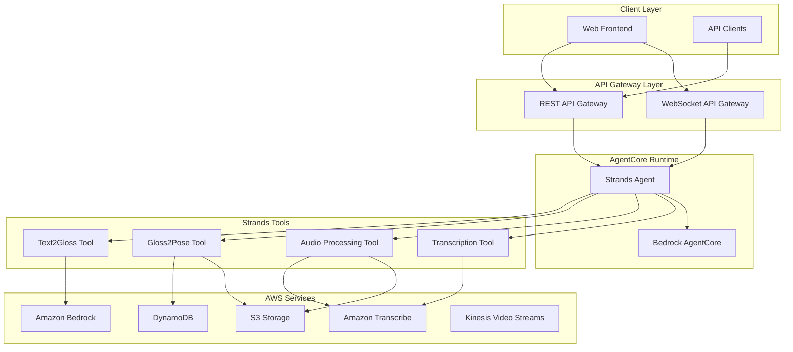

# Design Document

## Overview

This document outlines the design for migrating the GenASL (Generative AI-powered American Sign Language) translator from AWS Step Functions orchestration to a Strands-based agent architecture deployed on AWS Bedrock AgentCore. The new architecture will provide more flexible orchestration, conversational capabilities, and improved maintainability while preserving all existing functionality.

### Current Architecture Analysis

The existing system uses AWS Step Functions to orchestrate a translation pipeline:
1. **Input Processing**: Handles text input directly or audio input via AWS Transcribe
2. **Text-to-Gloss Conversion**: Uses Bedrock models to convert English text to ASL gloss notation
3. **Gloss-to-Video Generation**: Converts ASL gloss to pose sequences and generates avatar videos
4. **API Layer**: REST API and WebSocket API for client interactions

### Migration Goals

- Replace Step Functions orchestration with intelligent Strands agent
- Convert existing Lambda functions to Strands tools
- Maintain API compatibility and performance
- Add conversational capabilities
- Improve error handling and user experience

## Architecture

### High-Level Architecture



### Component Architecture

#### 1. Strands Agent Core
- **Framework**: Strands framework for tool orchestration
- **Runtime**: AWS Bedrock AgentCore for managed execution
- **Model**: Amazon Nova Lite v1:0 for natural language understanding
- **Capabilities**: 
  - Natural language request processing
  - Tool orchestration and workflow management
  - Error handling and retry logic
  - Conversational interaction

#### 2. Strands Tools (Converted from Lambda Functions)

##### Text2Gloss Tool
- **Purpose**: Convert English text to ASL gloss notation
- **Input**: English text string
- **Output**: ASL gloss string
- **Dependencies**: Amazon Bedrock (Nova Lite model)
- **Error Handling**: Retry on transient failures, fallback responses

##### Gloss2Pose Tool
- **Purpose**: Convert ASL gloss to pose sequences and generate videos
- **Input**: ASL gloss string, optional parameters (pose_only, pre_sign)
- **Output**: Video URLs (pose, sign, avatar), metadata
- **Dependencies**: DynamoDB (pose data), S3 (video storage), FFmpeg layer
- **Processing**: Multi-threaded video generation, S3 upload with presigned URLs

##### Audio Processing Tool
- **Purpose**: Handle audio input and coordinate transcription
- **Input**: Audio file (S3 location) or stream reference
- **Output**: Transcribed text
- **Dependencies**: Amazon Transcribe, S3 storage
- **Features**: Language detection, job status monitoring

##### Transcription Tool
- **Purpose**: Manage AWS Transcribe jobs and extract results
- **Input**: Transcription job name
- **Output**: Extracted text from transcription results
- **Dependencies**: Amazon Transcribe
- **Error Handling**: Job status polling, result validation

##### Real-time ASL Analysis Tool (New)
- **Purpose**: Analyze ASL video/images for reverse translation
- **Input**: Video streams (Kinesis Video Streams) or image files
- **Output**: Interpreted ASL text
- **Dependencies**: Amazon Bedrock (Llama model), image processing
- **Features**: Frame extraction, multi-modal analysis

## Components and Interfaces

### 1. Agent Entry Point

```python
@app.entrypoint
def invoke(payload):
    """Main agent entry point"""
    user_message = payload.get("message", "")
    request_type = payload.get("type", "text")  # text, audio, video
    
    response = agent(user_message)
    return response.message['content'][0]['text']
```

### 2. Tool Interfaces

#### Text2Gloss Tool Interface
```python
@tool
def text_to_asl_gloss(text: str) -> str:
    """Convert English text to ASL gloss notation"""
    # Implementation preserves existing logic
    pass
```

#### Gloss2Pose Tool Interface
```python
@tool
def gloss_to_video(gloss_sentence: str, text: str = None, 
                  pose_only: bool = False, pre_sign: bool = True) -> dict:
    """Convert ASL gloss to pose sequences and videos"""
    # Returns: {'PoseURL': url, 'SignURL': url, 'AvatarURL': url, 'Gloss': gloss, 'Text': text}
    pass
```

#### Audio Processing Tool Interface
```python
@tool
def process_audio_input(bucket_name: str, key_name: str) -> str:
    """Process audio file and return transcribed text"""
    # Coordinates transcription job creation and monitoring
    pass
```

### 3. API Integration Layer

#### REST API Handler
```python
def api_handler(event, context):
    """Handle REST API requests and route to agent"""
    request_body = json.loads(event['body'])
    
    # Route different request types to agent
    if 'text' in request_body:
        payload = {"message": request_body['text'], "type": "text"}
    elif 'audio' in request_body:
        payload = {"message": f"Process audio from {request_body['bucket']}/{request_body['key']}", 
                  "type": "audio"}
    
    response = agent_app.invoke(payload)
    return format_api_response(response)
```

#### WebSocket Handler
```python
def websocket_handler(event, context):
    """Handle WebSocket messages and route to agent"""
    message = json.loads(event['body'])
    
    # Enhanced with agent capabilities
    if 'StreamName' in message:
        payload = {"message": f"Analyze ASL video stream {message['StreamName']}", 
                  "type": "video"}
    else:
        payload = {"message": message.get('text', ''), "type": "text"}
    
    response = agent_app.invoke(payload)
    broadcast_response(response, event)
```

## Data Models

### 1. Agent Request Model
```python
@dataclass
class AgentRequest:
    message: str
    type: str  # 'text', 'audio', 'video'
    metadata: Dict[str, Any] = field(default_factory=dict)
    session_id: Optional[str] = None
```

### 2. Tool Response Model
```python
@dataclass
class ToolResponse:
    success: bool
    data: Dict[str, Any]
    error: Optional[str] = None
    metadata: Dict[str, Any] = field(default_factory=dict)
```

### 3. Translation Result Model
```python
@dataclass
class TranslationResult:
    original_text: str
    gloss: str
    pose_url: Optional[str] = None
    sign_url: Optional[str] = None
    avatar_url: Optional[str] = None
    processing_time: float = 0.0
    confidence: float = 1.0
```

## Error Handling

### 1. Tool-Level Error Handling
- **Retry Logic**: Implement exponential backoff for transient failures
- **Fallback Strategies**: Graceful degradation when services are unavailable
- **Error Classification**: Distinguish between retryable and non-retryable errors

### 2. Agent-Level Error Handling
- **Conversation Context**: Maintain error context for user-friendly explanations
- **Recovery Strategies**: Attempt alternative approaches when primary tools fail
- **User Communication**: Provide clear, actionable error messages

### 3. System-Level Error Handling
- **Circuit Breakers**: Prevent cascade failures in dependent services
- **Health Checks**: Monitor tool and service availability
- **Alerting**: Integrate with CloudWatch for operational monitoring

## Testing Strategy

### 1. Unit Testing
- **Tool Testing**: Individual Strands tool functionality
- **Mock Dependencies**: AWS service mocking for isolated testing
- **Edge Cases**: Error conditions and boundary value testing

### 2. Integration Testing
- **Agent Workflow**: End-to-end translation pipeline testing
- **API Compatibility**: Ensure existing API contracts are maintained
- **Performance Testing**: Validate response times and throughput

### 3. Migration Testing
- **Parallel Execution**: Run both systems simultaneously during migration
- **Result Comparison**: Validate output equivalence between systems
- **Rollback Testing**: Ensure ability to revert to Step Functions if needed

### 4. Load Testing
- **Concurrent Requests**: Test agent performance under load
- **Resource Utilization**: Monitor memory and CPU usage
- **Scaling Behavior**: Validate AgentCore auto-scaling capabilities

## Deployment Strategy

### 1. Infrastructure as Code
- **CDK Updates**: Modify existing CDK stack to include AgentCore resources
- **Environment Variables**: Maintain existing configuration patterns
- **IAM Permissions**: Preserve security model with minimal changes

### 2. Phased Migration
- **Phase 1**: Deploy agent alongside existing Step Functions
- **Phase 2**: Route percentage of traffic to new agent
- **Phase 3**: Full migration with Step Functions as fallback
- **Phase 4**: Remove Step Functions infrastructure

### 3. Monitoring and Observability
- **CloudWatch Metrics**: Agent performance and error rates
- **X-Ray Tracing**: Distributed tracing for debugging
- **Custom Dashboards**: Operational visibility into translation pipeline

### 4. Configuration Management
- **Environment Parity**: Consistent configuration across environments
- **Feature Flags**: Control migration rollout and feature enablement
- **Secrets Management**: Secure handling of API keys and credentials

## Performance Considerations

### 1. Latency Optimization
- **Tool Caching**: Cache frequently used gloss-to-pose mappings
- **Connection Pooling**: Reuse AWS service connections
- **Parallel Processing**: Maintain multi-threaded video generation

### 2. Throughput Management
- **Agent Scaling**: Leverage AgentCore auto-scaling capabilities
- **Resource Allocation**: Optimize memory and CPU allocation
- **Queue Management**: Handle request queuing during peak loads

### 3. Cost Optimization
- **Model Selection**: Use appropriate Bedrock models for each use case
- **Resource Rightsizing**: Optimize Lambda function configurations
- **Storage Optimization**: Implement S3 lifecycle policies for generated videos

## Security Considerations

### 1. Authentication and Authorization
- **IAM Integration**: Maintain existing IAM role-based access
- **API Security**: Preserve existing API Gateway security configurations
- **Service-to-Service**: Secure communication between agent and tools

### 2. Data Protection
- **Encryption**: Maintain encryption at rest and in transit
- **PII Handling**: Secure processing of user audio and text data
- **Audit Logging**: Comprehensive logging for compliance requirements

### 3. Network Security
- **VPC Configuration**: Deploy agent within existing VPC if required
- **Security Groups**: Maintain network access controls
- **Endpoint Security**: Secure API Gateway and WebSocket endpoints